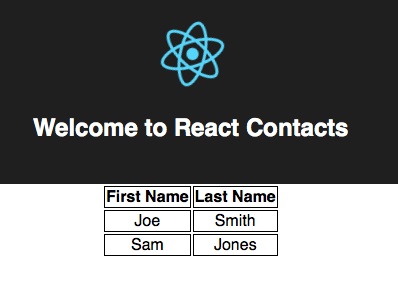
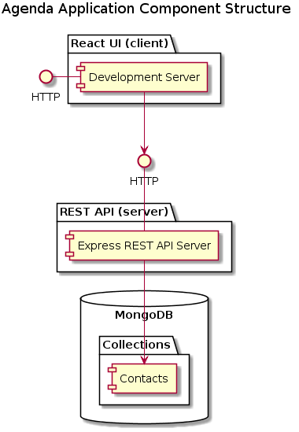

SWEN 200, Class Collaboration Project: Agenda
==============================================

This is the GitHub repository for `Agenda` the 
next viral app on the InterWebs(tm)! Check.

To get started, open a terminal window in the `agenda` directory containing this
repository. Build the docker images for client/server:

    sh -v build_images.sh

Once that's done, launch all three processes, execute:

    docker-compose up

And make sure you get at UI at:

http://docker.ui.ip.address:3000/

where "docker.ui.IP" is the IP adress of your docker instance (this
is probably 127.0.0.1 for docker for Mac/Windows or 192.168.99.100 for
folks using docker-toolbox). So either:

http://127.0.0.1:3000/

or 

http://192.168.99.100:3000/

Initializing the Database
===========================

You'll want to put some data into the database to see the (crude) UI
so start a fresh shell in the mongo container:

        $ docker exec -it agenda_mongo_1 bash
        
You'll get a shell prompt like this:
        
        root@d97046b06efd:/# 

Use the `mongoimport` command to import the json file from the repository:

    root@d97046b06efd:/# mongoimport -d testdb -c contacts < /data/exchange/initdata.json 
    2018-10-22T09:08:28.574+0000	connected to: localhost
    2018-10-22T09:08:28.577+0000	imported 2 documents
    root@d97046b06efd:/# exit

Now when you refresh the UI in the web browser it should show two contacts:

Application Architecture
========================

As we discussed before, I've already built and "architected", an example application
that you'll be using as a starting point. This application is a simple
extension of two previous projects: A React UI (project 5) in the `client` directory
and a MongoDB based REST API server (project 6) in the `server` directory.
The setup of these two folders is very nearly *identical* to the setup of 
each corresponding assignment from before break.

The basic application structure looks like this:

Each package runs as a separate process in debug mode. In production
the UI will be deliverd by nginx, or apache while the REST API will
be served by express proxied by nginx or apache.

Testing
========

Example tests are set up for the `client` folder (yarn test, as usual).

For now, I'd say test the REST API using the same approach we used in project 6.
I'll be introducing asynchronous tests and mocking as we go.

Anyway, this is your starting point. Enjoy!

