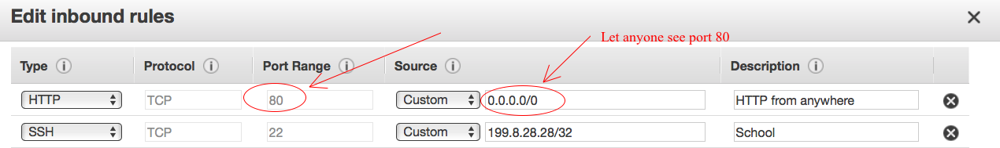
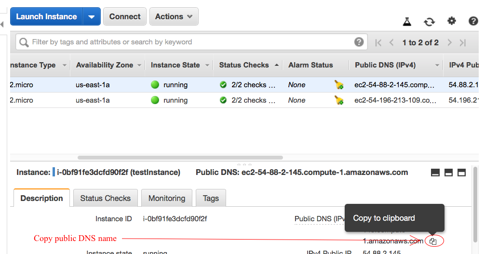
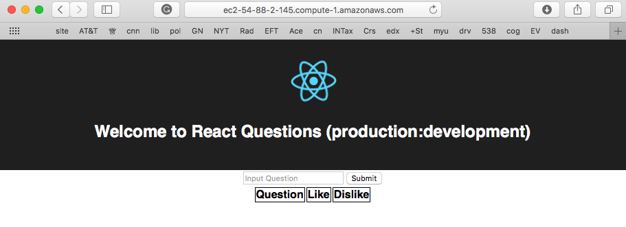

# Deploy agenda on an EC2 server

If you're following along with the class you've got an EC2 server running. Good! 

Note: If you're not sure about that you can click [here](TBD). 

I'll walk you through this, [details here](https://docs.aws.amazon.com/AmazonECS/latest/developerguide/docker-basics.html)

Log in to your EC2 instance with ssh, similar to this:

    ssh -i .ssh/awseducate.pem ec2-user@ec2-54-88-2-145.compute-1.amazonaws.com
    
You should be greeted with a linux prompt:

    Last login: Sun Dec  2 14:35:57 2018 from 99-38-167-135.lightspeed.iplsin.sbcglobal.net

           __|  __|_  )
           _|  (     /   Amazon Linux AMI
          ___|\___|___|

    https://aws.amazon.com/amazon-linux-ami/2018.03-release-notes/

First you need to install docker and start the docker daemon:

    [ec2-user@ip-172-31-36-196 ~]$ sudo yum update
    Loaded plugins: priorities, update-motd, upgrade-helper
    No packages marked for update
    [ec2-user@ip-172-31-36-196 ~]$ sudo yum install docker
    Loaded plugins: priorities, update-motd, upgrade-helper
    Resolving Dependencies
    --> Running transaction check
    ---> Package docker.x86_64 0:18.06.1ce-5.22.amzn1 will be installed
    --> Processing Dependency: xfsprogs for package: docker-18.06.1ce-5.22.amzn1.x86_64
    --> Processing Dependency: pigz for package: docker-18.06.1ce-5.22.amzn1.x86_64
    --> Processing Dependency: libseccomp.so.2()(64bit) for package: docker-18.06.1ce-5.22.amzn1.x86_64
    --> Processing Dependency: libltdl.so.7()(64bit) for package: docker-18.06.1ce-5.22.amzn1.x86_64
    blah, blah, blah
    
    Total download size: 47 M
    Installed size: 154 M
    Is this ok [y/d/N]: y
    
Answer "yes" here, then:

    Downloading packages:
    (1/5): libseccomp-2.3.1-2.4.amzn1.x86_64.rpm                                     |  79 kB  00:00:00     
    (2/5): libtool-ltdl-2.4.2-20.4.8.5.32.amzn1.x86_64.rpm                           |  51 kB  00:00:00     
    (3/5): pigz-2.3.3-1.6.amzn1.x86_64.rpm                                           |  71 kB  00:00:00     
    blah, blah, blah

    Dependency Installed:
      libseccomp.x86_64 0:2.3.1-2.4.amzn1           libtool-ltdl.x86_64 0:2.4.2-20.4.8.5.32.amzn1          
      pigz.x86_64 0:2.3.3-1.6.amzn1                 xfsprogs.x86_64 0:4.5.0-9.21.amzn1                     

    Complete!

Start the docker daemon:

    [ec2-user@ip-172-31-36-196 ~]$ sudo service docker start
    Starting cgconfig service:                                 [  OK  ]
    Starting docker:	.                                  [  OK  ]

Now add the ec2-user to the docker group:

    sudo usermod -a -G docker ec2-user

When you log back in be sure to forward your ssh keys using "-A":

    aluminum:~ steve$ ssh -A -i .ssh/awseducate.pem ec2-user@ec2-54-88-2-145.compute-1.amazonaws.com
    Last login: Sun Dec  2 20:44:34 2018 from 99-38-167-135.lightspeed.iplsin.sbcglobal.net

           __|  __|_  )
           _|  (     /   Amazon Linux AMI
          ___|\___|___|

    https://aws.amazon.com/amazon-linux-ami/2018.03-release-notes/

This will enable you to access GitHub withuot a password:

Now install `git`:

    [ec2-user@ip-172-31-36-196 ~]$ sudo yum install git
    Loaded plugins: priorities, update-motd, upgrade-helper
    amzn-main                                                                         | 2.1 kB  00:00:00     
    amzn-updates                                                                      | 2.5 kB  00:00:00     
    Resolving Dependencies
    --> Running transaction check
    blah, blah, blah
    
Next clone the repo:

    [ec2-user@ip-172-31-36-196 ~]$ git clone git@github.com:201810-SWEN-200/agenda.git
    Cloning into 'agenda'...
    The authenticity of host 'github.com (192.30.253.113)' can't be established.
    RSA key fingerprint is SHA256:nThbg6kXUpJWGl7E1IGOCspRomTxdCARLviKw6E5SY8.
    RSA key fingerprint is MD5:16:27:ac:a5:76:28:2d:36:63:1b:56:4d:eb:df:a6:48.
    Are you sure you want to continue connecting (yes/no)? yes
    Warning: Permanently added 'github.com,192.30.253.113' (RSA) to the list of known hosts.
    remote: Enumerating objects: 157, done.
    remote: Counting objects: 100% (157/157), done.
    remote: Compressing objects: 100% (103/103), done.
    remote: Total 803 (delta 96), reused 110 (delta 54), pack-reused 646
    Receiving objects: 100% (803/803), 403.21 KiB | 21.22 MiB/s, done.
    Resolving deltas: 100% (504/504), done.
    [ec2-user@ip-172-31-36-196 ~]$ 

Now cd into the `agenda` directory and buildl the images:

    [ec2-user@ip-172-31-36-196 ~]$ cd agenda/
    [ec2-user@ip-172-31-36-196 agenda]$ sh build_images.sh 
    docker build -t agenda_ui .
    Sending build context to Docker daemon  474.1kB
    Step 1/8 : FROM node:10.9.0-alpine
    10.9.0-alpine: Pulling from library/node
    8e3ba11ec2a2: Pull complete 
    e883c863a46d: Pull complete 
    f84102466f54: Pull complete 
    Digest: sha256:a4212307484e6b662806a538ec6352182aaf8b4b748644aaa7f6e87bda159097
    Status: Downloaded newer image for node:10.9.0-alpine
    blah, blah, blah

Now instal docker-compose:

    sudo pip install docker-compose
    
And finally launch the application:

    docker-compose -f docker-compose-prod.yml up -d
    
You can monitor the processes like so:

    [ec2-user@ip-172-31-36-196 agenda]$ docker-compose -f docker-compose-prod.yml ps
         Name                  Command             State                             Ports                          
    ----------------------------------------------------------------------------------------------------------------
    agenda_api_1     yarn start                    Up       3000/tcp, 0.0.0.0:3001->3001/tcp, 0.0.0.0:9230->9229/tcp
    agenda_mongo_1   docker-entrypoint.sh mongod   Up       0.0.0.0:27017->27017/tcp                                
    agenda_nginx_1   nginx -g daemon off;          Up       0.0.0.0:80->80/tcp                                      
    agenda_ui_1      yarn build                    Exit 0                                                           
    
    
To allow traffic into your instance, edit the security policy to allow all IPs to see port 80:

Finally copy/paste the public DNS name into your browser:

And viola!

