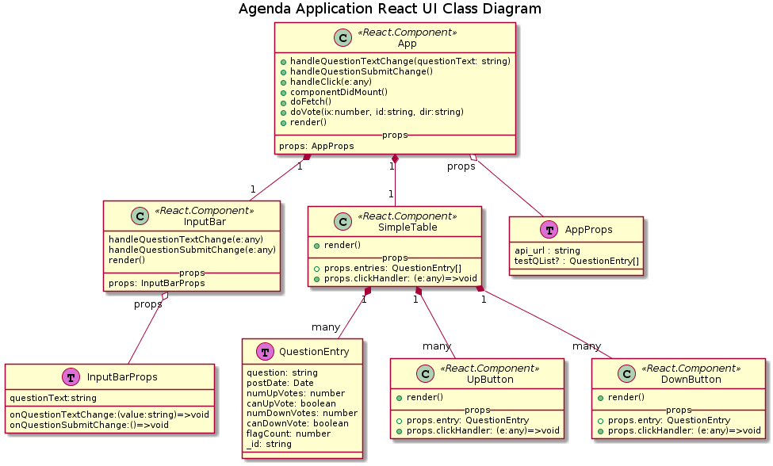
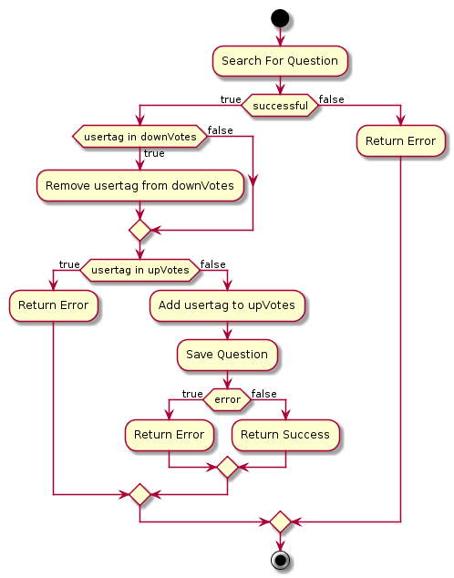

# Agenda Application Documentation

# Overview

# User Stories

# Classes

The ReactJS UI class relationships are described by the following UML Diagram.

# Voting

As an example the "UpVote" logic is described below:

