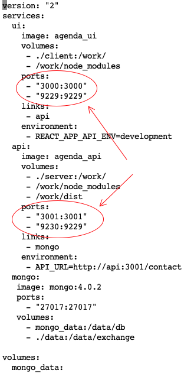
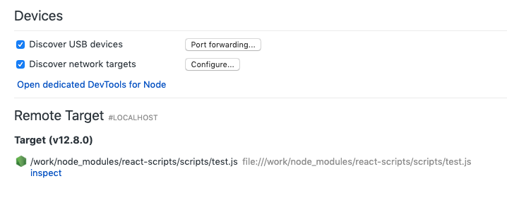
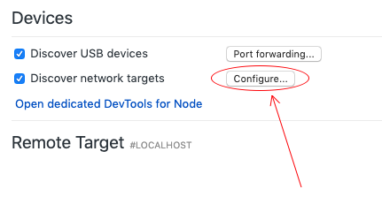
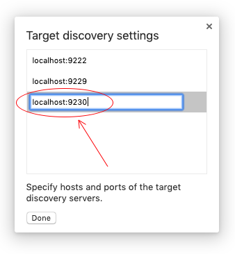
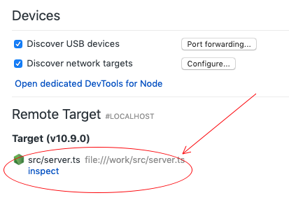

Debugging with Chrome with node running in a container.
-------------------------------------------------------

In the docker-compose.yml file (the development docker configuration file) there
are open ports set up for debugging on the client and server side. You
can run a debug session even when the code is running in a container 
by connecting to one of these open ports, either in the chrome debugger
or from VS Code. The easiest is chrome. The idea is to run the process 
in question using the '--inspect-brk' command line option. 

Debugging the Client Tests
--------------------------

There is already a target in the client package.json that does this using 
the react-scripts 'test' function. You can simply run a "ui" shell like so:

    docker-compose run --rm --service-ports ui sh
    
Then in the shell execute:

    yarn test:debug
    
This will start the tests script but add a break before any actual tests are invoked.

    $ docker-compose run --rm --service-ports ui sh
    Starting agenda_mongo_1 ... done
    Starting agenda_api_1   ... done
    /work # yarn test:debug
    yarn run v1.17.3
    $ react-scripts --inspect-brk=0.0.0.0:9229 test --runInBand --env=jsdom
    Debugger listening on ws://0.0.0.0:9229/6686a6c2-fb07-4862-bd49-01209701ec5c
    For help, see: https://nodejs.org/en/docs/inspector

You can then navigate to:

[chrome://inspect/](chrome://inspect/)

in chrome to connect. If you don't see something like this:

You may need to configure the ports to search. For the client side you'll need to
tell chrome to look for port 9229. For the server port 9230 (as specified in the 
docker-compose.yml file).

On the server side, the situation is similar, start an api container like so:

    docker-compose run --rm --service-ports api sh

Then, in that container, launch the api server using node rather than ts-node like so:

      node --require ts-node/register --inspect-brk=0.0.0.0:9229 src/server.ts 

Then in chrome navigate to: 

[chrome://inspect/](chrome://inspect/)

You should see something like this:

Click on the "inspect" link and debug away! You can add "debugger" 
lines to your source code to force breakpoints at certain locations.
